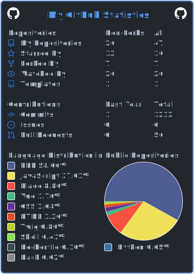
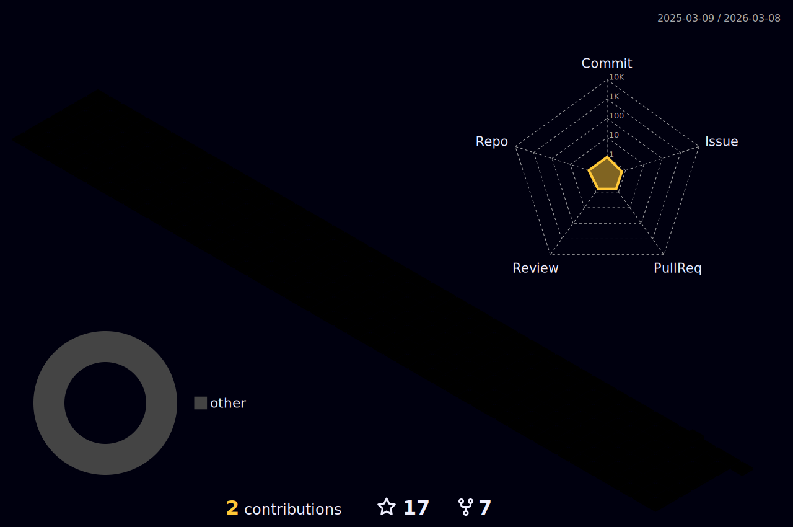

<!--   my-ticker -->

<!---->
  

  <a href="https://github.com/dmarsal90">
  
    
    
    
    
    

  
  

 :slightly_smiling_face: About me

- 🔭 I’m currently working on backend projects.

- 🌱 I’m currently learning **ReactJS** and **Astro**

- 👯 I’m looking to collaborate on **back-end or full stack web apps**

- 💬 Ask me about anything, I am happy to help.

- 📫 How to reach me:  

  
  
  
  
  

  
  <a href="https://github.com/dmarsal90">
  
  
  

 
    

  
 
 

   
  
   
  
  

    

    

  
  
  
 <!-- -->
  
  

  

  
:trophy: Github Trophies

  
  

  

<h3 align="left">My Stack:</h3>

<h3 align="center">

</h3>

You can ask me anything (within reason). I am looking forward to absorb knowledge🧠,gain experience 🏭, collaborate🤝 and build amazing products 🏭for the world🌍!

  

    *If you liked my profile, you can Star ⭐ the repo and if you want to use this template you can Fork it and can use.*  
    Thanks for visiting :heart:
   

  

