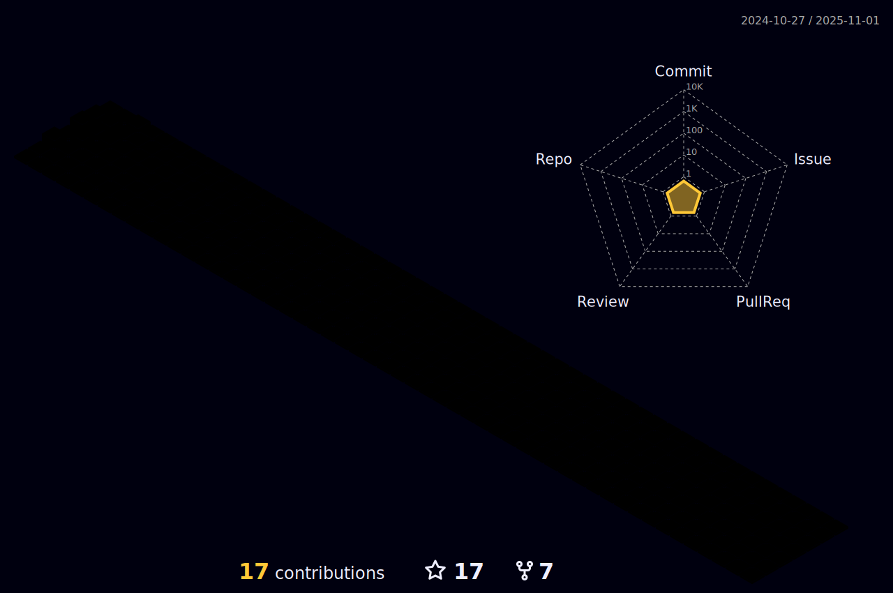

<h1 align="center">Hi 👋, I'm David</h1>
<h3 align="center">A passionate full stack developer</h3>

  <a href="https://github.com/dmarsal90">
    

  

  <a href="https://github.com/dmarsal90">
  
  
  

  

  

  

  
:slightly_smiling_face: More about me

- 🔭 I’m currently working on backend projects

- 🌱 I’m currently learning **ReactJS**

- 👯 I’m looking to collaborate on **back-end or full stack web apps**

- 💬 Ask me about anything, I am happy to help

- 📫 How to reach me:  

  
  
   
  
  

    
   
      

  
  
  
 <!-- -->
  
  

  

  
:trophy: Github Trophies

  
  

  

<h3 align="left">My Stack:</h3>

<h3 align="center">

</h3>

You can ask me anything (within reason). I am looking forward to absorb knowledge🧠,gain experience 🏭, collaborate🤝 and build amazing products 🏭for the world🌍!
